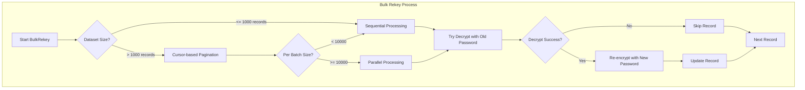

# Architecture

This document describes the architecture of VaultStore, including design patterns, key decisions, and system components.

## High-Level Architecture

VaultStore follows a layered architecture pattern with clear separation of concerns:


## Core Components

### 1. Store Interface (`StoreInterface`)

The main interface that defines all vault operations. It provides:

- **Record Management**: CRUD operations for records
- **Token Operations**: Token lifecycle management
- **Query Operations**: Flexible querying capabilities
- **Database Management**: Migration and connection handling

### 2. Record System

Records are the fundamental data storage units:

```go
type RecordInterface interface {
    // Data access
    Data() map[string]string
    DataChanged() map[string]string
    
    // Getters
    GetID() string
    GetToken() string
    GetValue() string
    GetCreatedAt() string
    GetUpdatedAt() string
    GetExpiresAt() string
    GetSoftDeletedAt() string
    
    // Setters
    SetID(id string) RecordInterface
    SetToken(token string) RecordInterface
    SetValue(value string) RecordInterface
    // ... other setters
}
```

### 3. Token System

Tokens provide secure access to stored values:

- **Unique Generation**: Cryptographically secure random tokens
- **Password Protection**: Optional password encryption
- **Expiration**: Time-based access control
- **Soft Delete**: Recoverable deletion mechanism

### 4. Query Interface

Flexible querying system using the builder pattern:

```go
query := vaultstore.RecordQuery().
    SetToken("abc123").
    SetLimit(10).
    SetOrderBy("created_at").
    SetSortOrder("desc").
    SetSoftDeletedInclude(false)
```

## Design Patterns

### 1. Interface Segregation

VaultStore uses multiple focused interfaces rather than one large interface:

- `StoreInterface` - Main store operations
- `RecordInterface` - Record data operations
- `RecordQueryInterface` - Query building operations

### 2. Builder Pattern

The query system uses the builder pattern for flexible query construction:

```go
query := vaultstore.RecordQuery().
    SetToken(token).
    SetLimit(limit).
    SetOrderBy("created_at")
```

### 3. Factory Pattern

Store creation uses a factory pattern with options:

```go
vault, err := vaultstore.NewStore(vaultstore.NewStoreOptions{
    VaultTableName:     "vault",
    DB:                 db,
    AutomigrateEnabled: true,
})
```

### 4. Repository Pattern

The store implementation acts as a repository, abstracting database operations:

```go
type storeImplementation struct {
    vaultTableName          string
    vaultMetaTableName      string
    automigrateEnabled      bool
    db                      *sql.DB
    gormDB                  *gorm.DB
    dbDriverName            string
    debugEnabled            bool
    cryptoConfig            *CryptoConfig
    parallelThreshold       int     // Configurable threshold for parallel bulk rekey
}
```

## Data Flow

### Token Creation Flow


### Token Read Flow


## Security Architecture

### Encryption Strategy

1. **Value Encryption**: Stored values are encrypted using AES-256-GCM
2. **Password Protection**: Optional password-based encryption
3. **Token Security**: Cryptographically secure random token generation
4. **Data at Rest**: All sensitive data is encrypted in the database

### Access Control


## Database Schema

### Vault Table Structure

```sql
CREATE TABLE vault (
    id              TEXT PRIMARY KEY,
    token           TEXT UNIQUE NOT NULL,
    value           TEXT NOT NULL,           -- Encrypted value
    created_at      TEXT NOT NULL,
    updated_at      TEXT NOT NULL,
    expires_at      TEXT,                   -- Optional expiration
    soft_deleted_at TEXT,                   -- Soft delete timestamp
    data            TEXT                    -- JSON metadata
);

CREATE INDEX IF NOT EXISTS idx_vault_soft_deleted_at ON vault(soft_deleted_at);
CREATE INDEX IF NOT EXISTS idx_vault_token ON vault(token);
```

### Metadata Table Structure

The vault_meta table stores vault settings (no password metadata for security):

```sql
CREATE TABLE vault_meta (
    id           INTEGER PRIMARY KEY AUTOINCREMENT,
    object_type  TEXT NOT NULL,    -- 'vault' only
    object_id    TEXT NOT NULL,    -- Unique ID for the object
    meta_key     TEXT NOT NULL,    -- Setting key
    meta_value   TEXT,             -- Setting value
    created_at   TEXT NOT NULL,
    updated_at   TEXT NOT NULL
);

CREATE INDEX idx_vault_meta_obj ON vault_meta(object_type, object_id, meta_key);
```

#### Object Types

**Vault Settings Objects:**
- `object_type`: `vault`
- `object_id`: `settings`
- `meta_key`: Setting name (e.g., `version`)
- `meta_value`: Setting value

## Pure Encryption Bulk Rekey

### Architecture Overview

The pure encryption approach eliminates all password metadata storage for maximum security:



### Processing Strategies

**Sequential Processing (Small Datasets):**
- Single-threaded iteration through records
- Simple error handling
- Low memory overhead
- Best for < 10,000 records

**Parallel Processing (Large Datasets):**
- 10 worker goroutines processing batches
- Batch size: 100 records per worker
- Error channel prioritization for race condition prevention
- Best for >= 10,000 records

**Cursor-based Pagination (Very Large Datasets):**
- Fetch records in chunks of 1000
- Process each chunk sequentially
- Prevents memory exhaustion
- Suitable for millions of records

### Security Benefits

1. **Zero Metadata Leakage**: No password hashes or identity data stored
2. **Correlation Attack Prevention**: Cannot determine which records share passwords
3. **Simplified Security Model**: Only encryption keys to protect
4. **Database Query Safety**: No sensitive data in query logs or backups

### Performance Characteristics

| Dataset Size | Strategy | Expected Time | Memory |
|--------------|----------|---------------|--------|
| 1,000 | Sequential | 1-2 seconds | Low |
| 10,000 | Sequential/Parallel | 10-20 seconds | Medium |
| 100,000 | Parallel | 1-2 minutes | Medium |
| 1,000,000 | Cursor + Parallel | 10-20 minutes | Low |

### Configuration

```go
vault, err := vaultstore.NewStore(vaultstore.NewStoreOptions{
    VaultTableName:    "vault",
    DB:                db,
    ParallelThreshold: 10000, // Switch to parallel at this count
})
```

## Migration Strategy

### Auto-Migration

VaultStore provides automatic database migration:

```go
vault, err := vaultstore.NewStore(vaultstore.NewStoreOptions{
    VaultTableName:     "vault",
    DB:                 db,
    AutomigrateEnabled: true,  // Auto-create tables
})
```

### Migration Process

1. **Check Table Existence**: Verify if vault table exists
2. **Create Table**: Create table with proper schema if needed
3. **Index Creation**: Create necessary indexes for performance
4. **Validation**: Verify table structure

## Performance Considerations

### Database Optimization

1. **Indexing**: Token and ID fields are indexed
2. **Query Optimization**: Efficient SQL generation
3. **Connection Pooling**: Leverages database connection pooling
4. **Batch Operations**: Support for bulk operations where applicable

### Memory Management

1. **Lazy Loading**: Records loaded on demand
2. **Efficient Encryption**: Minimal memory overhead for encryption
3. **Resource Cleanup**: Proper resource management

## Error Handling Strategy

### Error Types

```go
// Validation errors
var ErrTokenRequired = errors.New("token is required")
var ErrPasswordRequired = errors.New("password is required")

// Database errors
var ErrRecordNotFound = errors.New("record not found")
var ErrTokenAlreadyExists = errors.New("token already exists")

// Encryption errors
var ErrInvalidPassword = errors.New("invalid password")
var ErrDecryptionFailed = errors.New("decryption failed")
```

### Error Handling Patterns

1. **Graceful Degradation**: Non-critical errors don't crash the system
2. **Contextual Errors**: Errors include relevant context
3. **Recovery Strategies**: Retry mechanisms for transient failures
4. **Logging**: Comprehensive error logging for debugging

## Extension Points

### Custom Encryption

VaultStore allows custom encryption implementations:

```go
type Encryptor interface {
    Encrypt(value string, password string) (string, error)
    Decrypt(encryptedValue string, password string) (string, error)
}
```

### Custom Validators

Add custom validation logic:

```go
type Validator interface {
    ValidateToken(token string) error
    ValidatePassword(password string) error
}
```

## See Also

- [API Reference](api_reference.md) - Detailed API documentation
- [Modules](modules/) - Individual module documentation
- [Getting Started](getting_started.md) - Setup and usage guide
- [Configuration](configuration.md) - Configuration options
- [Bulk Rekey](modules/bulk_rekey.md) - Pure encryption bulk rekey documentation

## Changelog

- **v1.2.0** (2026-02-04): Removed identity-based password management architecture. Added pure encryption bulk rekey architecture with cursor-based pagination and parallel processing strategies.
- **v1.1.0** (2026-02-03): Added documentation for vault_meta table structure and identity-based password management architecture.
- **v1.0.0** (2026-02-03): Initial architecture documentation
