# Data Flow

This document describes how data moves through the VaultStore system, from creation to retrieval and deletion.

## Data Lifecycle Overview

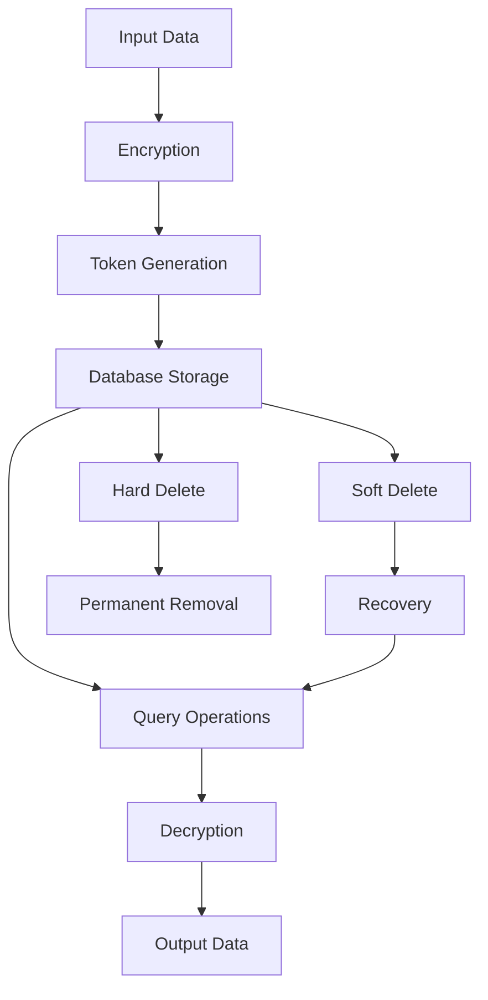

## Token Creation Flow

### Step-by-Step Process

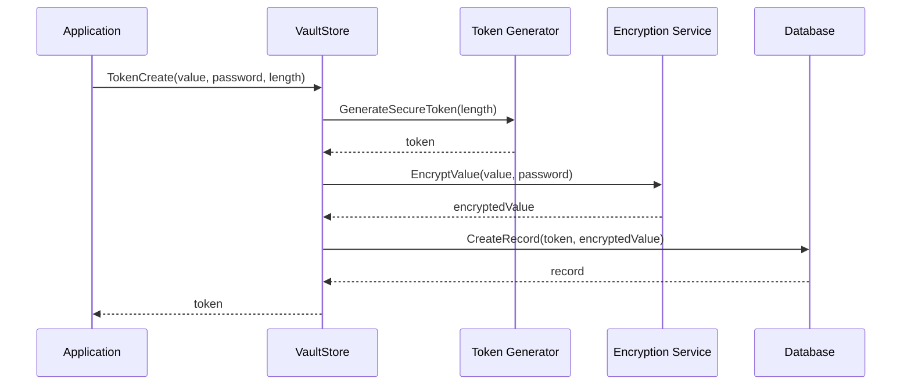

### Data Transformations

1. **Input**: Plain text value and optional password
2. **Token Generation**: Cryptographically secure random token
3. **Encryption**: Value encrypted using AES-256-GCM with password-derived key
4. **Storage**: Token and encrypted value stored in database
5. **Output**: Generated token returned to application

### Security Considerations

- **Token Generation**: Uses `crypto/rand` for cryptographically secure randomness
- **Encryption**: AES-256-GCM provides authenticated encryption
- **Password Handling**: Passwords are never stored in plain text
- **Key Derivation**: Uses PBKDF2 for password-based key derivation

## Token Retrieval Flow

### Step-by-Step Process

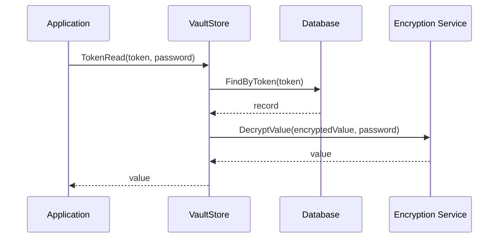

### Data Validation

1. **Token Existence**: Verify token exists in database
2. **Soft Delete Check**: Ensure token is not soft deleted
3. **Expiration Check**: Verify token has not expired
4. **Password Verification**: Validate password if required
5. **Decryption**: Decrypt and return the value

### Error Handling

- **Token Not Found**: Return `ErrRecordNotFound`
- **Soft Deleted**: Return `ErrRecordNotFound`
- **Expired**: Return `ErrRecordNotFound`
- **Invalid Password**: Return `ErrInvalidPassword`
- **Decryption Failed**: Return `ErrDecryptionFailed`

## Query Operations Flow

### Query Building

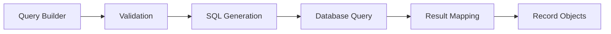

### Query Execution

1. **Query Construction**: Build query using builder pattern
2. **Validation**: Validate query parameters
3. **SQL Generation**: Convert query to SQL using goqu
4. **Database Execution**: Execute SQL query
5. **Result Mapping**: Map database rows to record objects
6. **Filtering**: Apply additional filters (soft delete, etc.)

### Query Types

#### Simple Query

```go
query := vaultstore.NewRecordQuery().
    SetToken("abc123")
```

#### Complex Query

```go
query := vaultstore.NewRecordQuery().
    SetTokenIn([]string{"token1", "token2"}).
    SetLimit(10).
    SetOrderBy("created_at").
    SetSortOrder("desc").
    SetSoftDeletedInclude(false)
```

## Update Operations Flow

### Token Update Process

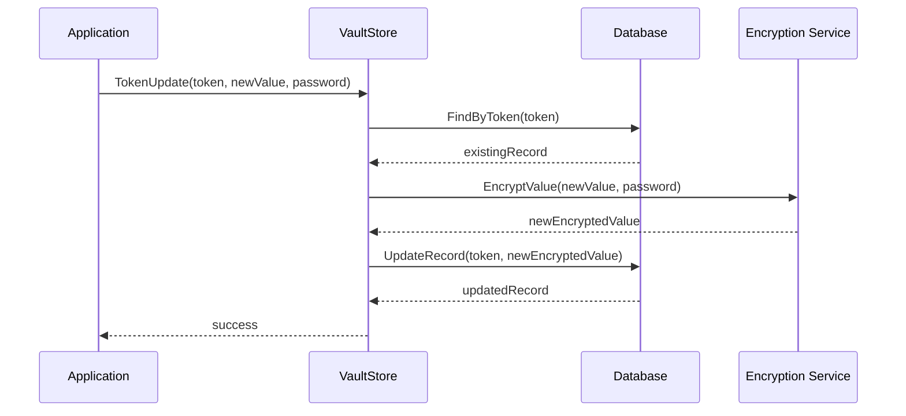

### Update Validation

1. **Token Existence**: Verify token exists
2. **Current Password**: Validate current password if required
3. **New Encryption**: Encrypt new value with password
4. **Timestamp Update**: Update `updated_at` timestamp
5. **Atomic Update**: Perform atomic database update

## Delete Operations Flow

### Soft Delete Process

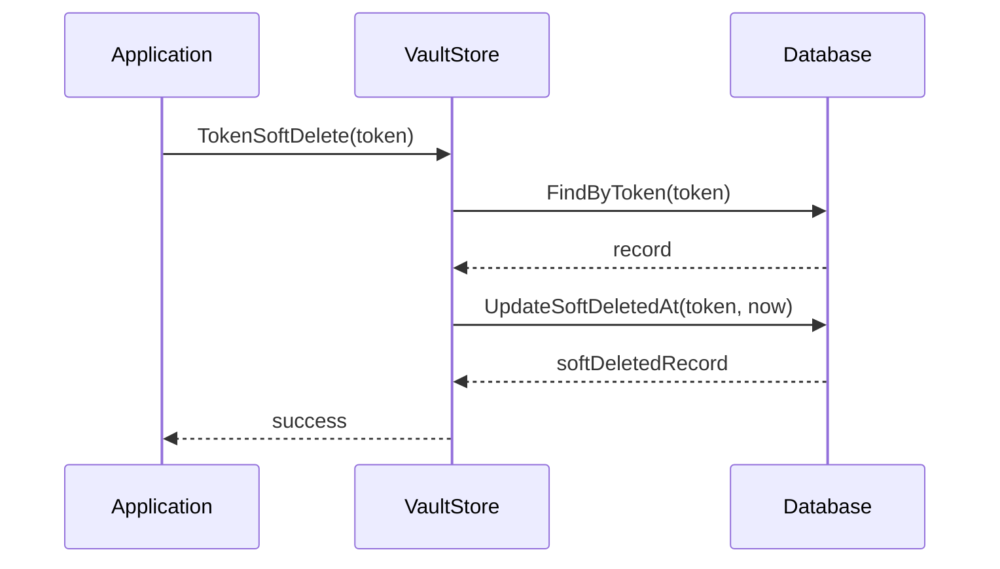

### Hard Delete Process

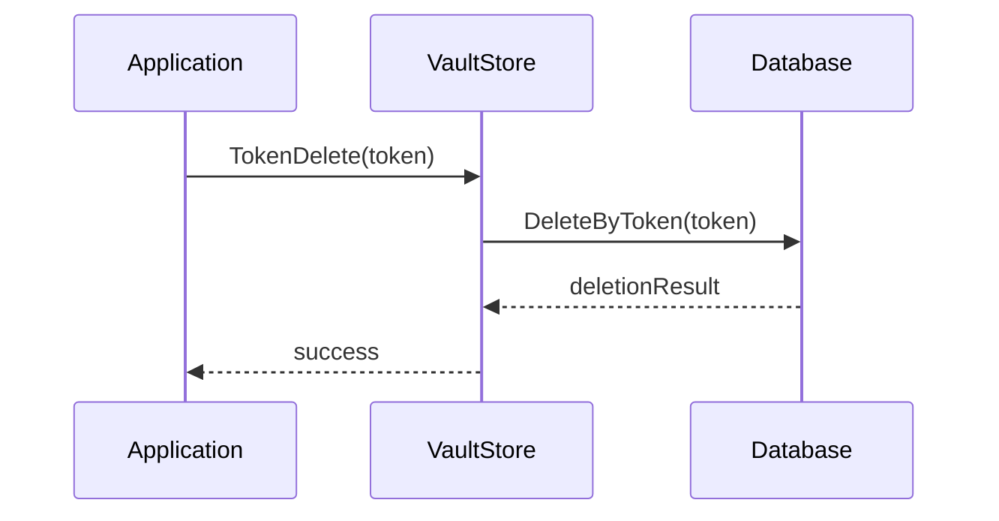

### Delete Strategies

| Operation | Recovery | Data Removal | Use Case |
|-----------|----------|--------------|----------|
| Soft Delete | Yes | Logical | Temporary deletion, recovery needed |
| Hard Delete | No | Physical | Permanent removal, compliance |

## Batch Operations Flow

### Expired Token Cleanup

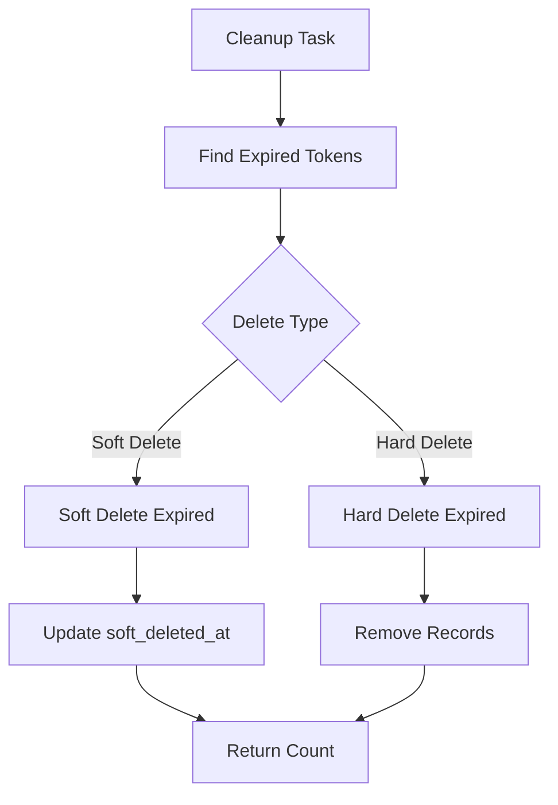

### Batch Read Operations

```go
// Multiple token read
values, err := vault.TokensRead(ctx, []string{"token1", "token2"}, "password")
```

1. **Token Validation**: Validate all tokens exist
2. **Batch Decryption**: Decrypt all values efficiently
3. **Result Mapping**: Map tokens to values
4. **Error Aggregation**: Collect and return errors

## Data Integrity Flow

### Validation Checks

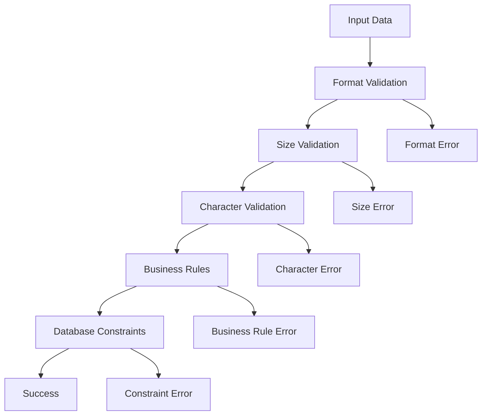

### Integrity Measures

1. **Input Validation**: Validate all input parameters
2. **Database Constraints**: Use database constraints for data integrity
3. **Transaction Safety**: Use database transactions for atomic operations
4. **Error Handling**: Comprehensive error handling and logging

## Performance Considerations

### Database Optimization

1. **Indexing**: Proper indexes on frequently queried fields
2. **Query Optimization**: Efficient SQL generation
3. **Connection Pooling**: Leverage database connection pooling
4. **Batch Operations**: Minimize database round trips

### Memory Management

1. **Lazy Loading**: Load data only when needed
2. **Efficient Encryption**: Minimize memory overhead
3. **Resource Cleanup**: Proper resource disposal
4. **Stream Processing**: Process large datasets efficiently

## Monitoring and Observability

### Key Metrics

- **Token Creation Rate**: Number of tokens created per time period
- **Query Performance**: Average query response time
- **Error Rates**: Frequency of different error types
- **Database Performance**: Connection pool usage, query times

### Logging Points

- **Token Operations**: Create, read, update, delete operations
- **Database Operations**: SQL queries, connection events
- **Security Events**: Failed authentications, suspicious activities
- **Performance Events**: Slow queries, resource usage

## Identity-Based Data Flows

These flows apply when `PasswordIdentityEnabled` is set to `true`.

### Token Creation with Identity

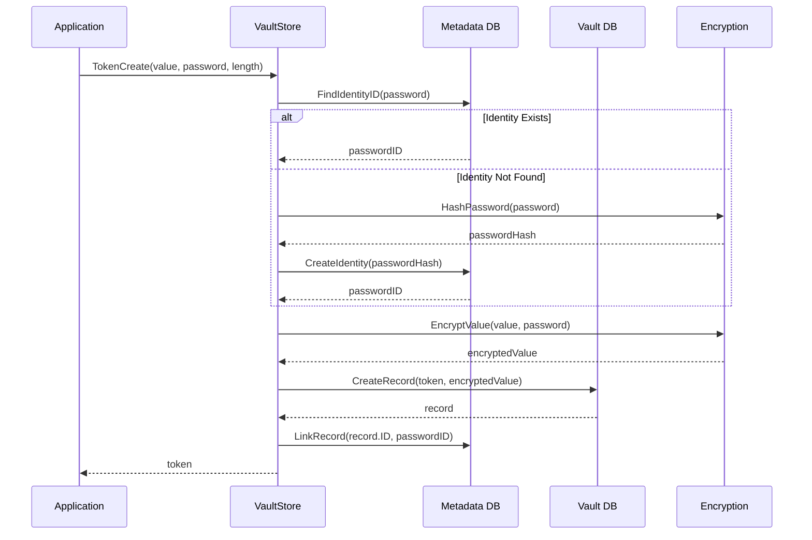

### Bulk Rekey Flow (Fast Path)

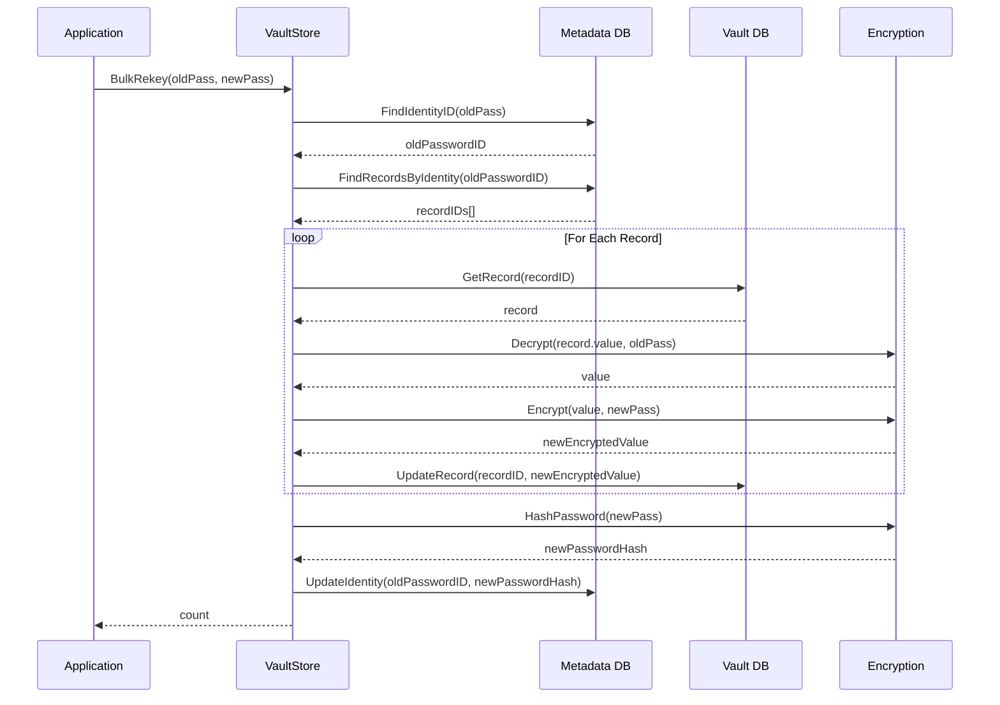

### Migration Flow

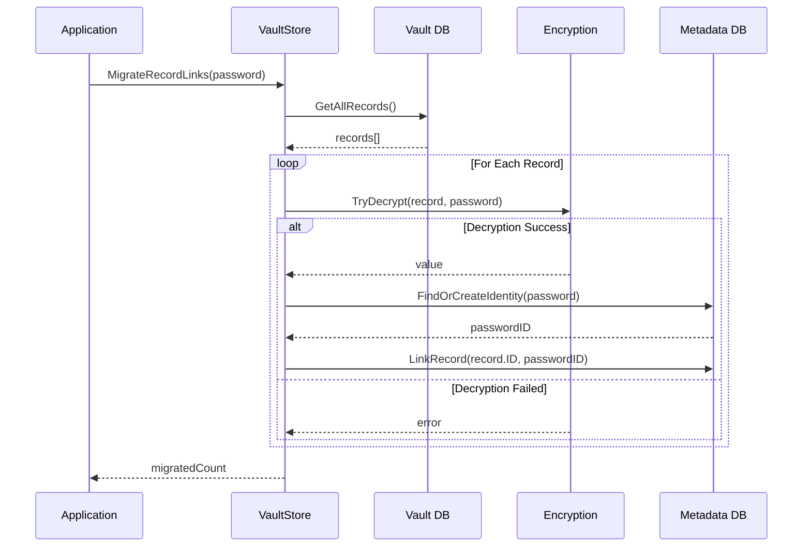

## See Also

- [Architecture](architecture.md) - System design and patterns
- [API Reference](api_reference.md) - Complete API documentation
- [Token Operations](modules/token_operations.md) - Token-specific operations
- [Query Interface](modules/query_interface.md) - Query system details
- [Password Identity Management](modules/password_identity_management.md) - Identity-based password management

## Changelog

- **v1.1.0** (2026-02-03): Added identity-based data flow diagrams for token creation, bulk rekey, and migration operations.
- **v1.0.0** (2026-02-03): Initial data flow documentation
