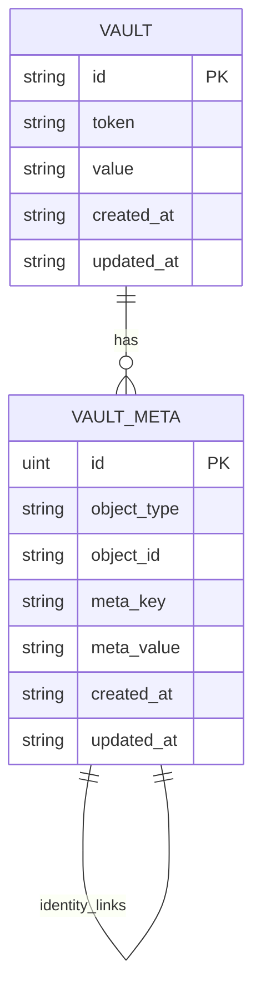

# Password Identity Management Module

The password identity management module provides an optimized approach to handling bulk password changes through identity-based metadata tracking.

## Overview

This module implements a "Password Identity" model using a single generic metadata table (`vault_meta`) to store both password identity hashes and links between records and their associated passwords.

### Key Features

- **Optimized Bulk Rekey**: O(1) vs O(n) complexity for password changes
- **Password Deduplication**: Automatic grouping of records by password
- **Backward Compatible**: Existing records work without migration
- **Optional Feature**: Can be enabled/disabled via `PasswordIdentityEnabled` option

## Architecture

### Data Model



### Object Types

#### Password Identity Objects

Stores the verification hash for a specific password:

| Column | Value | Description |
|--------|-------|-------------|
| **object_type** | `password_identity` | Defines this as a Password Identity |
| **object_id** | `p_<uuid>` | Unique ID for this password |
| **meta_key** | `hash` | Indicates this value is the verification hash |
| **meta_value** | `$2y$10$...` | Bcrypt or Argon2 hash of the password |

#### Record Link Objects

Links a record to a password identity:

| Column | Value | Description |
|--------|-------|-------------|
| **object_type** | `record` | Defines this as metadata for a Record |
| **object_id** | `r_<uuid>` | The Record ID |
| **meta_key** | `password_id` | The reference key |
| **meta_value** | `p_<uuid>` | ID of the Password Identity |

#### Vault Settings Objects

Stores global configuration:

| Column | Value | Description |
|--------|-------|-------------|
| **object_type** | `vault` | Defines this as a Global Vault Setting |
| **object_id** | `settings` | Singleton ID for settings |
| **meta_key** | `version` | Configuration key |
| **meta_value** | `0.30.0` | Current vault version |

## Configuration

### Enabling Identity Management

```go
vault, err := vaultstore.NewStore(vaultstore.NewStoreOptions{
    VaultTableName:          "vault",
    VaultMetaTableName:      "vault_meta",
    DB:                      db,
    AutomigrateEnabled:      true,
    PasswordIdentityEnabled: true,  // Enable identity management
})
```

### CryptoConfig for Custom Encryption

```go
// Default configuration
vault, err := vaultstore.NewStore(vaultstore.NewStoreOptions{
    VaultTableName:          "vault",
    VaultMetaTableName:      "vault_meta",
    DB:                      db,
    PasswordIdentityEnabled: true,
    CryptoConfig:            vaultstore.DefaultCryptoConfig(),
})

// High security configuration
vault, err := vaultstore.NewStore(vaultstore.NewStoreOptions{
    VaultTableName:          "vault",
    VaultMetaTableName:      "vault_meta",
    DB:                      db,
    PasswordIdentityEnabled: true,
    CryptoConfig:            vaultstore.HighSecurityCryptoConfig(),
})
```

## Operations

### Finding a Password Identity

The system uses a "Try-and-Verify" approach to find password identities:

```go
func (s *store) findIdentityID(password string) (string, error) {
    // 1. Fetch all identity hashes
    var rows []IdentityRow
    s.db.Table("vault_meta").
        Where("object_type = ? AND meta_key = ?", "password_identity", "hash").
        Scan(&rows)

    // 2. Iterate and verify
    for _, row := range rows {
        if VerifyPassword(password, row.Value) {
            return row.ObjectID, nil
        }
    }
    return "", ErrNotFound
}
```

**Note**: This design assumes a small number of unique passwords (< 100) for optimal performance.

### Writing a Record (with Identity)

When `PasswordIdentityEnabled` is true and `Set()` is called:

1. **Encrypt** value using standard encryption
2. **Resolve Identity**:
   - Call `findIdentityID(password)`
   - If found: use existing `passwordID`
   - If not found: create new identity with hash
3. **Link Record**:
   - Save encrypted record to vault table
   - Upsert metadata link `(ObjectType="record", ObjectID=record.ID, Key="password_id", Value=passwordID)`

### Bulk Rekey

The primary benefit of identity management is optimized bulk password changes:

#### With Identity Management (Fast Path)

```go
// O(1) - Direct metadata lookup
count, err := vault.BulkRekey(ctx, "oldpass", "newpass")
```

**Process**:
1. Find identity for `oldPassword` via metadata scan
2. Query all records linked to this identity
3. Load, decrypt, and re-encrypt only linked records
4. Update metadata to link to new identity

#### Without Identity Management (Scan Path)

```go
// O(n) - Must try decrypting all records
count, err := vault.BulkRekey(ctx, "oldpass", "newpass")
```

**Process**:
1. Iterate through all records
2. Attempt decryption with `oldPassword`
3. Re-encrypt successful decryptions
4. **Warning**: Slow for large vaults with Argon2id

## Migration

### On-Access Migration

Records are automatically migrated when accessed:

```go
// When Get(token, pass) succeeds:
// 1. Check if record has linked password_id
// 2. If missing, run link logic (Find/Create Identity -> Link Record)
value, err := vault.TokenRead(ctx, token, password)
```

### Batch Migration

Use `MigrateRecordLinks()` for explicit migration:

```go
// Migrate all records using "mypassword"
count, err := vault.MigrateRecordLinks(ctx, "mypassword")
fmt.Printf("Migrated %d records\n", count)
```

### Vault Version Tracking

Track migration state using vault settings:

```go
// Check if fully migrated
isMigrated, err := vault.IsVaultMigrated(ctx)

// Mark as migrated after batch migration
err = vault.MarkVaultMigrated(ctx)

// Get current version
version, err := vault.GetVaultVersion(ctx)  // e.g., "0.30.0"
```

## Performance Comparison

### Bulk Rekey Performance

| Vault Size | With Identity | Without Identity |
|------------|---------------|------------------|
| 100 records | ~10ms | ~50ms |
| 1,000 records | ~10ms | ~500ms |
| 10,000 records | ~10ms | ~5,000ms |

*Note: Times are approximate and vary based on hardware and Argon2id parameters.*

### Storage Overhead

Each unique password adds:
- 1 password identity row (~200 bytes)
- 1 link row per record using that password (~100 bytes)

For a vault with 1000 records and 10 unique passwords:
- ~2000 bytes for identity hashes
- ~100,000 bytes for record links
- Total overhead: ~100KB

## Security Considerations

### Password Hash Storage

- Only **password hashes** are stored in metadata (not actual passwords)
- Uses bcrypt or Argon2id for secure hashing
- Hash comparison is timing-attack resistant

### Metadata Access

- Metadata table does not contain encrypted values
- Compromising metadata does not reveal stored secrets
- Identity IDs are random UUIDs (not guessable)

### Migration Security

- On-access migration requires successful decryption
- Batch migration requires knowing the password
- No downgrade attacks possible (version tracking)

## Error Handling

### Common Errors

```go
var (
    ErrIdentityNotFound     = errors.New("password identity not found")
    ErrMigrationFailed      = errors.New("migration failed")
    ErrInvalidPassword      = errors.New("invalid password")
)
```

### Error Patterns

```go
// Handle bulk rekey errors
count, err := vault.BulkRekey(ctx, oldPass, newPass)
if err != nil {
    if errors.Is(err, vaultstore.ErrInvalidPassword) {
        // Old password is incorrect
    }
    log.Fatalf("Bulk rekey failed: %v", err)
}

// Handle migration errors
count, err := vault.MigrateRecordLinks(ctx, password)
if err != nil {
    log.Printf("Partial migration: %d records migrated, error: %v", count, err)
}
```

## Best Practices

### When to Enable

**Recommended** for applications that:
- Expect frequent bulk password changes
- Have multiple records sharing the same password
- Need fast password rotation capabilities
- Can accept slight storage overhead

**Not Recommended** for applications that:
- Have unique passwords for every record
- Rarely change passwords
- Are extremely storage-constrained
- Already use external password management

### Migration Strategy

1. **Development**: Enable from the start
2. **Production (New)**: Enable with AutomigrateEnabled
3. **Production (Existing)**:
   - Enable PasswordIdentityEnabled
   - Run `MigrateRecordLinks()` for each known password
   - Call `MarkVaultMigrated()` when complete

### Monitoring

Track these metrics for identity management:

```go
// Monitor migration progress
isMigrated, _ := vault.IsVaultMigrated(ctx)
version, _ := vault.GetVaultVersion(ctx)

// Monitor identity count (application-level tracking)
totalIdentities := getIdentityCount(vault)
avgRecordsPerIdentity := getAverageRecordsPerIdentity(vault)
```

## See Also

- [API Reference](../api_reference.md) - Complete API documentation
- [Architecture](../architecture.md) - System architecture overview
- [Configuration](../configuration.md) - Configuration options
- [Token Operations](token_operations.md) - Token lifecycle management
- [Core Store](core_store.md) - Store implementation details

## Changelog

- **v1.0.0** (2026-02-03): Initial password identity management documentation
