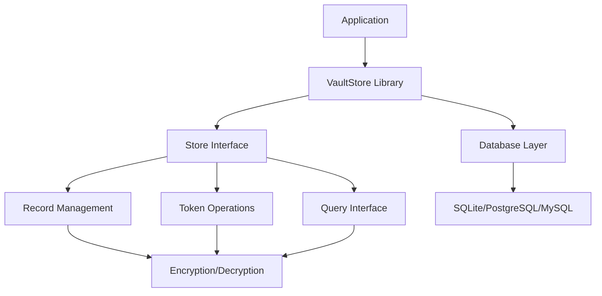

# VaultStore Overview

VaultStore is a secure value storage (data-at-rest) implementation for Go, designed as a library component for securely storing and retrieving secrets in applications.

## What is VaultStore?

VaultStore is specifically designed as a **data store component** for securely storing and retrieving secrets. It is **not** an API or a complete secrets management system. Features such as user management, access control, and API endpoints are intentionally beyond the scope of this project.

VaultStore is meant to be integrated into your application as a library, providing the data storage layer for your secrets management needs. The application using VaultStore is responsible for implementing any additional layers such as API endpoints, user management, or access control if needed.

## Key Features

- **Secure storage** of sensitive data with AES-256-GCM encryption
- **Token-based access** to secrets for secure retrieval
- **Password protection** for stored values with Argon2id key derivation
- **Pure encryption bulk rekey** for maximum security without metadata
- **Flexible query interface** for retrieving records
- **Soft delete functionality** for data recovery
- **Support for multiple database backends** (SQLite, PostgreSQL, MySQL)
- **Automatic database migration** support
- **Expiration handling** for time-limited secrets
- **Configurable cryptography** via CryptoConfig (Argon2id parameters)

## Architecture Overview

## Core Concepts

### Tokens
Tokens are unique identifiers that provide access to stored secrets. Each token is associated with:
- An encrypted value
- An optional password for additional security
- Creation and expiration timestamps
- Soft delete capability

### Records
Records are the underlying data structure that stores encrypted information. Each record contains:
- Unique ID and token
- Encrypted value
- Metadata (timestamps, deletion status)
- Optional additional data fields

### Store Interface
The main `StoreInterface` provides all operations for:
- Record CRUD operations
- Token lifecycle management
- Query and filtering capabilities
- Database management

## Use Cases

VaultStore is ideal for applications that need to:
- Store API keys and secrets securely
- Manage temporary access tokens
- Implement secure configuration storage
- Handle sensitive user data
- Provide encrypted data persistence

## Technology Stack

- **Language**: Go 1.25+
- **Database**: Database-agnostic (SQLite, PostgreSQL, MySQL supported)
- **ORM**: GORM
- **Encryption**: Go's crypto package
- **Query Builder**: goqu

## See Also

- [Getting Started](getting_started.md) - Installation and setup
- [Architecture](architecture.md) - Detailed system design
- [API Reference](api_reference.md) - Complete API documentation
- [Modules](modules/) - Detailed module documentation
- [Bulk Rekey](modules/bulk_rekey.md) - Pure encryption bulk rekey operations

## Changelog

- **v1.2.0** (2026-02-04): Removed identity-based password management, added pure encryption bulk rekey documentation
- **v1.1.0** (2026-02-03): Added documentation for identity-based password management, CryptoConfig, and updated technology stack details.
- **v1.0.0** (2026-02-03): Initial overview documentation
